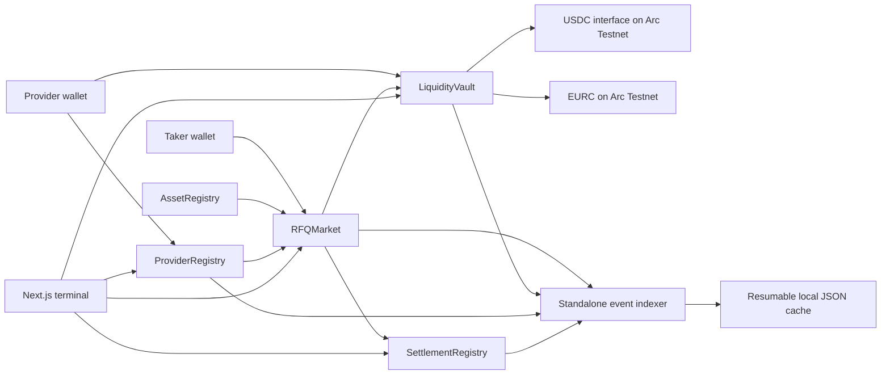
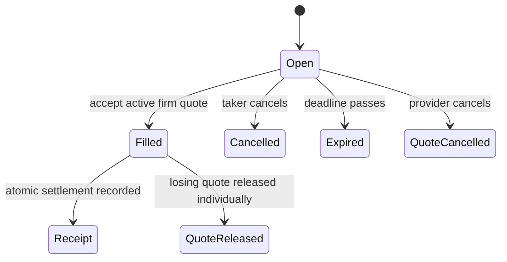
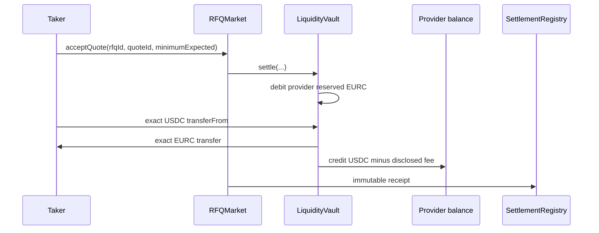
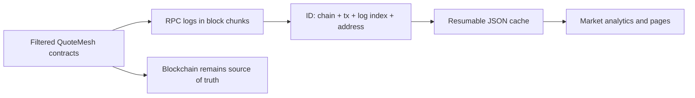

# QuoteMesh

QuoteMesh is an independent multi-provider stablecoin RFQ marketplace built on Arc Network.
Businesses and treasury operators request exact-input USDC/EURC prices, compare competing firm
quotes backed by reserved provider inventory, select one quote, and settle both legs atomically.

> QuoteMesh is an independent application built on Arc Network. It is not an official Arc, Circle,
> or StableFX product. References to Arc and Circle infrastructure describe external technology
> used by the application and do not imply endorsement.

Experimental Arc Testnet software. QuoteMesh smart contracts have not undergone a professional
third-party security audit.

**Frontend:** https://quotemesh.vercel.app

The public frontend currently shows the honest zero-state because QuoteMesh project contracts have
not been deployed or configured.

## Problem and value

AMMs expose users to pool curves and slippage; bilateral desk workflows often hide pricing and
settlement state. QuoteMesh offers a third path: multiple providers compete on an exact request,
each firm quote reserves its buy-side liquidity, and the taker chooses the final execution.

## Why Arc

Arc Testnet currently provides USDC-denominated gas, official USDC and EURC application interfaces,
EVM tooling, and sub-second deterministic finality. QuoteMesh models the UX as `Pending → Final`
and never asks users to hold ETH or wait for arbitrary confirmation counts.

## Roles

- **Taker:** creates public or invite-only RFQs, compares quotes, accepts one, cancels open RFQs,
  and reads receipts.
- **Provider:** self-registers a profile, deposits USDC/EURC, submits or replaces firm quotes,
  releases reservations, and withdraws available inventory.
- **Administrator:** allowlists assets/pairs and manages QuoteMesh-specific provider labels.
  Administrators cannot withdraw or seize provider/taker funds or rewrite receipts.

## Architecture



### RFQ lifecycle



### Settlement asset flow



### Event indexing



## Project-Deployed Contracts

No QuoteMesh contracts have been deployed yet. After a real broadcast, record only verified
addresses, deployment transactions, constructor arguments, and ArcScan source links here and in
`deployments/arc-testnet.json`.

| Contract | Responsibility | Major user functions |
| --- | --- | --- |
| `AssetRegistry` | Supported assets, directional pairs, notional limits | Read-only for users |
| `ProviderRegistry` | Provider profiles and factual execution totals | Register, update, pause, resume |
| `LiquidityVault` | Available/reserved balances and atomic asset movement | Deposit, withdraw |
| `RFQMarket` | RFQ, firm quote, release, fee, and execution state machine | Create/cancel RFQ, submit/replace/cancel/release/accept quote |
| `SettlementRegistry` | Immutable, paginated settlement receipts | Read receipts |

## External Arc and Circle Dependencies

These are not owned or deployed by QuoteMesh:

- Arc Testnet RPC and ArcScan;
- the USDC ERC-20 interface and EURC addresses documented for Arc Testnet;
- Arc Memo and Multicall3From transaction extensions;
- Permit2 and common Ethereum compatibility contracts;
- Circle App Kit Swap/Bridge/Unified Balance, when explicitly configured;
- StableFX escrow/reference infrastructure;
- browser wallets, Viem, Wagmi, OpenZeppelin, Foundry, Next.js, and the local event cache.

## Liquidity reservation and solvency

Each provider/token balance has `available` and `reserved` components. Submitting a quote moves the
exact buy amount from available to reserved. A selected quote consumes its reservation; losing
quotes remain reserved until cancelled, expired, or released individually. There is no unbounded
loop. The invariant for every token is:

```text
actual vault balance >= total available liability + total reserved liability
```

Unexpected direct transfers create untouched surplus. The MVP has no administrator sweep.

## Atomic settlement

Acceptance validates RFQ/quote ownership, status, expiries, minimum output, and fee bounds before
calling the vault. The vault updates liabilities, pulls the exact taker sell amount, delivers the
exact provider buy amount, credits the provider, and accrues the optional fee. Any transfer or
validation failure reverts every state change.

## Arc integrations

- **USDC/EURC:** official 6-decimal ERC-20 interfaces for application transfers.
- **Gas:** native USDC uses 18-decimal gas accounting; the UI never calls it ETH.
- **Finality:** wait for the committed receipt, then show final.
- **Multicall3From:** optional direct-EOA sender-preserving `approve + accept` batch with both
  failures fatal.
- **Memo:** optional direct-EOA acceptance wrapper; never nested inside Multicall3From.
- **App Kit:** not integrated. No App Kit or StableFX price is displayed or fabricated.
- **StableFX:** external only. No API or liquidity is fabricated.

## Local setup

Requirements: Node.js 20+, npm, and Foundry. The npm wrapper uses a local
`.tools/foundry/forge.exe` when present, then falls back to `forge` from `PATH`.

```powershell
cd D:\quotemesh
Copy-Item .env.example .env.local
npm install
npm run dev
```

Fill public contract addresses only after deployment. The UI deliberately shows honest zero states
when they are absent.

## Contract checks

```powershell
npm run forge:fmt
npm run forge:build
npm run forge:test
npm run forge:gas
```

Mocks live only under `test/mocks` and must never be deployed as public USDC/EURC substitutes.

## Frontend checks

```powershell
npm run lint
npm run typecheck
npm run build
```

## Indexer

Set deployed contract addresses and `NEXT_PUBLIC_DEPLOYMENT_BLOCK`, then run:

```powershell
npm run index
# Full re-index:
npm run index:reset
```

The cache is resumable, retries RPC failures, filters exact contract addresses, and deduplicates by
chain ID, transaction hash, log index, and contract address. It never determines authoritative
balances or settlement outcomes.

## Arc Testnet deployment

The frontend is deployed at https://quotemesh.vercel.app. Smart-contract deployment is prepared but
has not been executed. Import an encrypted Foundry keystore, fund it from the Circle faucet, then
use `scripts/deploy-arc-testnet.ps1`. Follow `docs/deployment.md`. Private keys must not be passed on
the CLI or committed.

The dated internal review record and manual launch gates are in
[`docs/final-readiness.md`](docs/final-readiness.md). It is not a third-party audit or deployment
evidence.

## Known limitations

- Testnet only and unaudited.
- Full-fill, exact-input RFQs only.
- Official USDC/EURC pair only in the public deployment plan.
- No confidential/private RFQ claim: invite-only authorization remains publicly visible.
- App Kit and StableFX reference panels remain disabled without documented configuration.
- No live Arc integration test or contract verification exists until deployment is requested.
- Lifetime analytics read logs directly from the configured RPC and are suitable for the Testnet
  MVP, not a high-volume production indexer.

## Roadmap

Independent security review, Arc Testnet deployment/evidence, hosted resumable indexing, provider
metadata pinning, production RPC redundancy, and additional officially supported stablecoin pairs.

## Official documentation consulted

- https://docs.arc.io/llms.txt
- https://docs.arc.io/arc-chain
- https://docs.arc.io/stablefx
- https://docs.arc.io/arc/concepts/stablecoin-native-model
- https://docs.arc.io/arc/concepts/deterministic-finality
- https://docs.arc.io/arc/concepts/transaction-memos
- https://docs.arc.io/arc/concepts/batched-transactions
- https://docs.arc.io/arc/references/contract-addresses
- https://docs.arc.io/arc/references/connect-to-arc
- https://docs.arc.io/arc/references/gas-and-fees
- https://docs.arc.io/arc/references/evm-differences
- https://docs.arc.io/app-kit
- https://docs.arc.io/app-kit/swap
- https://docs.arc.io/app-kit/bridge
- https://docs.arc.io/app-kit/unified-balance
- https://docs.arc.io/arc/tutorials/deploy-on-arc
- https://www.arc.io/brand-guidelines-and-partner-toolkit
- https://community.arc.io/home/blogs/arc-brand-guidelines-and-partner-toolkit-is-live-2026-07-16
