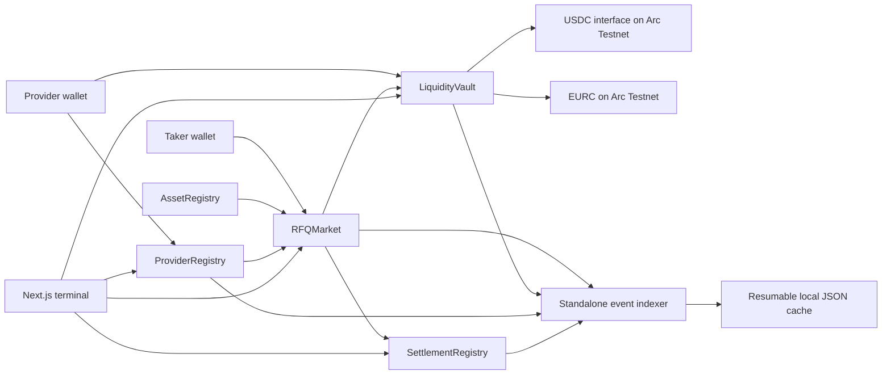
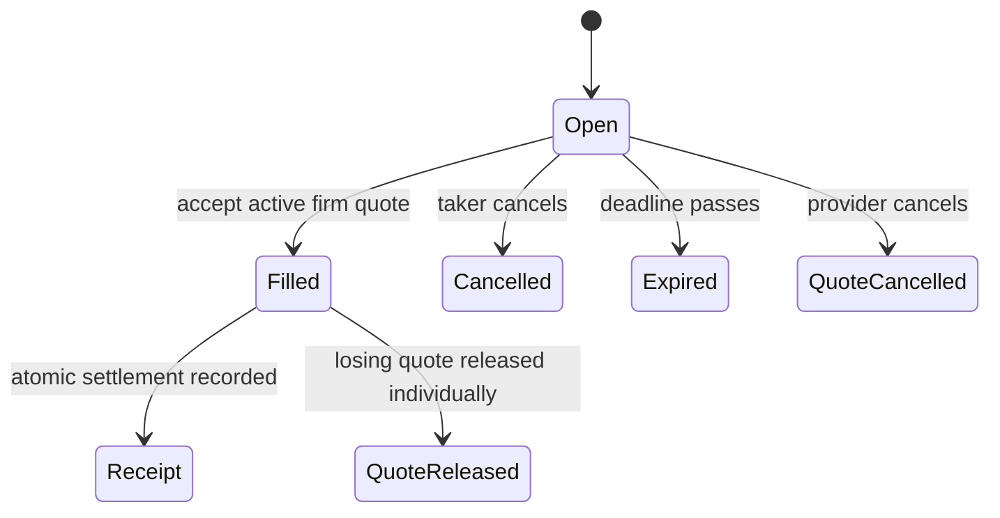
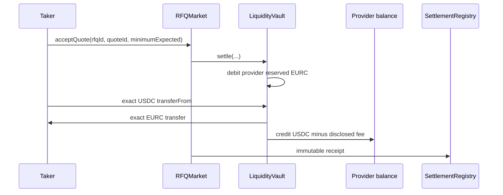
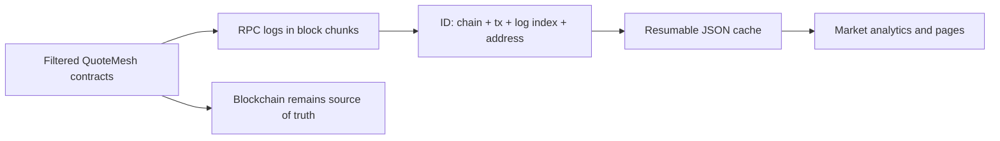

# QuoteMesh

QuoteMesh is an independent multi-provider stablecoin RFQ marketplace built on Arc Network.
Businesses and treasury operators request exact-input USDC/EURC prices, compare competing firm
quotes backed by reserved provider inventory, select one quote, and settle both legs atomically.

> QuoteMesh is an independent application built on Arc Network. It is not an official Arc, Circle,
> or StableFX product. References to Arc and Circle infrastructure describe external technology
> used by the application and do not imply endorsement.

Experimental Arc Testnet software. QuoteMesh smart contracts have not undergone a professional
third-party security audit.

**Frontend:** https://quotemesh.vercel.app

The public frontend is configured for the verified Arc Testnet deployment listed below.

## Problem and value

AMMs expose users to pool curves and slippage; bilateral desk workflows often hide pricing and
settlement state. QuoteMesh offers a third path: multiple providers compete on an exact request,
each firm quote reserves its buy-side liquidity, and the taker chooses the final execution.

## Why Arc

Arc Testnet currently provides USDC-denominated gas, official USDC and EURC application interfaces,
EVM tooling, and sub-second deterministic finality. QuoteMesh models the UX as `Pending → Final`
and never asks users to hold ETH or wait for arbitrary confirmation counts.

## Roles

- **Taker:** creates public or invite-only RFQs, compares quotes, accepts one, cancels open RFQs,
  and reads receipts.
- **Provider:** self-registers a profile, deposits USDC/EURC, submits or replaces firm quotes,
  releases reservations, and withdraws available inventory.
- **Administrator:** allowlists assets/pairs and manages QuoteMesh-specific provider labels.
  Administrators cannot withdraw or seize provider/taker funds or rewrite receipts.

## Architecture



### RFQ lifecycle



### Settlement asset flow



### Event indexing



## Project-Deployed Contracts

All addresses below are project contracts on Arc Testnet (`5042002`), deployed in block
`53965111`. Full constructor parameters and initialization transactions are in
[`deployments/arc-testnet.json`](deployments/arc-testnet.json).

| Contract | Address | Responsibility | Deployment / verified source |
| --- | --- | --- | --- |
| `AssetRegistry` | `0x32906f2105bC66F9508091c4cAfe4cD0D7F95394` | Supported assets, directional pairs, notional limits | [tx](https://testnet.arcscan.app/tx/0xe1ce6727a91a3af5ecc61df0a89bc67647d86e61f6014d3cc2661d8993a9b462) / [source](https://testnet.arcscan.app/address/0x32906f2105bc66f9508091c4cafe4cd0d7f95394?tab=contract) |
| `ProviderRegistry` | `0x2Ea027838Acf30B1be649cb0738e982ad5709859` | Provider profiles and factual execution totals | [tx](https://testnet.arcscan.app/tx/0x6225d61fb0de6c3eca7f382bf3a040b7f2facc59dbd0c312ba7df65f5cba8776) / [source](https://testnet.arcscan.app/address/0x2ea027838acf30b1be649cb0738e982ad5709859?tab=contract) |
| `SettlementRegistry` | `0x14D7Ac9BD50f66D93c21c82BB61F9bE7f72C51be` | Unique immutable settlement receipts | [tx](https://testnet.arcscan.app/tx/0x8a891f041dafa749611f361da11fada9ac15c7f11748c53860a0b7b4b458e71f) / [source](https://testnet.arcscan.app/address/0x14d7ac9bd50f66d93c21c82bb61f9be7f72c51be?tab=contract) |
| `LiquidityVault` | `0xfeAe059ECd0248C917A80a079F67fDe53B7a3fe5` | Available/reserved balances and atomic asset movement | [tx](https://testnet.arcscan.app/tx/0x28cc25c322a317de49b8d0c5cf2e671f3eb77cd72882a020bc6e4b7dd386591f) / [source](https://testnet.arcscan.app/address/0xfeae059ecd0248c917a80a079f67fde53b7a3fe5?tab=contract) |
| `RFQMarket` | `0xe9633B9D35a786A5cE2ebCF3e28D5f78dDDbA3c9` | RFQ, firm quote, release, fee, and execution state machine | [tx](https://testnet.arcscan.app/tx/0xf35b087fadf19d21132504f9cfe6c575ed0a6daa66bd9bdcba02e5db91987b36) / [source](https://testnet.arcscan.app/address/0xe9633b9d35a786a5ce2ebcf3e28d5f78dddba3c9?tab=contract) |

Constructor ownership is assigned to
`0x8600D14106aBeaBd7Ef96e82D03C0a3a73bB0AEB`; RFQMarket uses the four registry/vault addresses
above, the same address as fee recipient, and a deployed protocol fee of `0` bps.

## Live Arc Testnet lifecycle

A self-controlled lifecycle was completed on Arc Testnet with the same user wallet acting as taker
and provider. It is integration evidence, not evidence of an independent counterparty,
institutional liquidity, or market adoption.

- Provider registration:
  [tx](https://testnet.arcscan.app/tx/0x5d94139f82c19698d1f469b4ba62909083b63158d4712fb29bbb5ed71d74aec3)
- Deposit of `2.000000 USDC`:
  [tx](https://testnet.arcscan.app/tx/0x108239d2dd166bb3840921922e1e8d1d7c17c92d0357d4d7837e07ebcc45d387)
- Public RFQ `#1`, selling `1.000000 EURC` for at least `1.000000 USDC`:
  [tx](https://testnet.arcscan.app/tx/0x2e0134a5995524bb8810c5b3fb0f8e0b9b7915de2eacb74b437e4aa5d7e46de1)
- Firm quote `#1`, reserving `1.000000 USDC`:
  [tx](https://testnet.arcscan.app/tx/0x02130ae173bf60166801040b02d0229ec45cdf4012d0c6793640cb2cfb78e547)
- Atomic acceptance and settlement:
  [tx](https://testnet.arcscan.app/tx/0x9c5a20a2395acb1ce6595583ce2184e21794021b689d6a0cad3dbc824015f9a6)
- Settlement receipt trade ID:
  `0x008b6e0c0d8c578cfb43300818ca3749ea55faef078025291ea5fd1963fe1fcc`

The post-settlement vault state was independently queried: `1.000000 USDC` and `1.000000 EURC`
available, zero reserved for both tokens, and actual vault balances exactly equal liabilities.
Both token solvency checks returned `true`.

## External Arc and Circle Dependencies

These are not owned or deployed by QuoteMesh:

- Arc Testnet RPC and ArcScan;
- the USDC ERC-20 interface and EURC addresses documented for Arc Testnet;
- Arc Memo and Multicall3From transaction extensions;
- Permit2 and common Ethereum compatibility contracts;
- Circle App Kit Swap/Bridge/Unified Balance, when explicitly configured;
- StableFX escrow/reference infrastructure;
- browser wallets, Viem, Wagmi, OpenZeppelin, Foundry, Next.js, and the local event cache.

## Liquidity reservation and solvency

Each provider/token balance has `available` and `reserved` components. Submitting a quote moves the
exact buy amount from available to reserved. A selected quote consumes its reservation; losing
quotes remain reserved until cancelled, expired, or released individually. There is no unbounded
loop. The invariant for every token is:

```text
actual vault balance >= total available liability + total reserved liability
```

Unexpected direct transfers create untouched surplus. The MVP has no administrator sweep.

## Atomic settlement

Acceptance validates RFQ/quote ownership, status, expiries, minimum output, and fee bounds before
calling the vault. The vault updates liabilities, pulls the exact taker sell amount, delivers the
exact provider buy amount, credits the provider, and accrues the optional fee. Any transfer or
validation failure reverts every state change.

## Arc integrations

- **USDC/EURC:** official 6-decimal ERC-20 interfaces for application transfers.
- **Gas:** native USDC uses 18-decimal gas accounting; the UI never calls it ETH.
- **Finality:** wait for the committed receipt, then show final.
- **Multicall3From:** optional direct-EOA sender-preserving `approve + accept` batch with both
  failures fatal.
- **Memo:** optional direct-EOA acceptance wrapper; never nested inside Multicall3From.
- **App Kit:** not integrated. No App Kit or StableFX price is displayed or fabricated.
- **StableFX:** external only. No API or liquidity is fabricated.

## Local setup

Requirements: Node.js 20+, npm, and Foundry. The npm wrapper uses a local
`.tools/foundry/forge.exe` when present, then falls back to `forge` from `PATH`.

```powershell
cd D:\quotemesh
Copy-Item .env.example .env.local
npm install
npm run dev
```

Fill public contract addresses only after deployment. The UI deliberately shows honest zero states
when they are absent.

## Contract checks

```powershell
npm run forge:fmt
npm run forge:build
npm run forge:test
npm run forge:gas
```

Mocks live only under `test/mocks` and must never be deployed as public USDC/EURC substitutes.

## Frontend checks

```powershell
npm run lint
npm run typecheck
npm run build
```

## Indexer

Set deployed contract addresses and `NEXT_PUBLIC_DEPLOYMENT_BLOCK`, then run:

```powershell
npm run index
# Full re-index:
npm run index:reset
```

The cache is resumable, retries RPC failures, filters exact contract addresses, and deduplicates by
chain ID, transaction hash, log index, and contract address. It never determines authoritative
balances or settlement outcomes.

## Wallet RPC troubleshooting

QuoteMesh configures new Arc Testnet wallet connections with the current official `.arc.io` RPC
endpoints. If a wallet was previously configured with `https://rpc.testnet.arc.network`, it can
return HTTP 403 before a transaction is signed. Open the wallet's network settings for Arc Testnet
and set the default RPC to `https://rpc.blockdaemon.testnet.arc.io`, then retry. The application
detects this failure and displays the same recovery instruction with a copy action.

Current endpoints: https://docs.arc.io/arc/references/rpc-endpoints

## Arc Testnet deployment

The verified contracts are deployed on Arc Testnet and the frontend is configured at
https://quotemesh.vercel.app. Deployment evidence and reproducible encrypted-keystore operations
are documented in [`docs/deployment.md`](docs/deployment.md). Private keys must not be passed on the
CLI or committed.

The dated internal review record and manual launch gates are in
[`docs/final-readiness.md`](docs/final-readiness.md). It is not a third-party audit or deployment
evidence.

## Known limitations

- Testnet only and unaudited.
- Full-fill, exact-input RFQs only.
- Official USDC/EURC pair only in the public deployment plan.
- No confidential/private RFQ claim: invite-only authorization remains publicly visible.
- App Kit and StableFX reference panels remain disabled without documented configuration.
- The deployment and source verification do not constitute a professional security audit.
- Any documented self-controlled lifecycle uses one wallet as both taker and provider; it is
  integration evidence, not independent institutional liquidity or market activity.
- Lifetime analytics read logs directly from the configured RPC and are suitable for the Testnet
  MVP, not a high-volume production indexer.

## Roadmap

Independent security review, Arc Testnet deployment/evidence, hosted resumable indexing, provider
metadata pinning, production RPC redundancy, and additional officially supported stablecoin pairs.

## Official documentation consulted

- https://docs.arc.io/llms.txt
- https://docs.arc.io/arc-chain
- https://docs.arc.io/stablefx
- https://docs.arc.io/arc/concepts/stablecoin-native-model
- https://docs.arc.io/arc/concepts/deterministic-finality
- https://docs.arc.io/arc/concepts/transaction-memos
- https://docs.arc.io/arc/concepts/batched-transactions
- https://docs.arc.io/arc/references/contract-addresses
- https://docs.arc.io/arc/references/rpc-endpoints
- https://docs.arc.io/arc/references/connect-to-arc
- https://docs.arc.io/arc/references/gas-and-fees
- https://docs.arc.io/arc/references/evm-differences
- https://docs.arc.io/app-kit
- https://docs.arc.io/app-kit/swap
- https://docs.arc.io/app-kit/bridge
- https://docs.arc.io/app-kit/unified-balance
- https://docs.arc.io/arc/tutorials/deploy-on-arc
- https://www.arc.io/brand-guidelines-and-partner-toolkit
- https://community.arc.io/home/blogs/arc-brand-guidelines-and-partner-toolkit-is-live-2026-07-16
